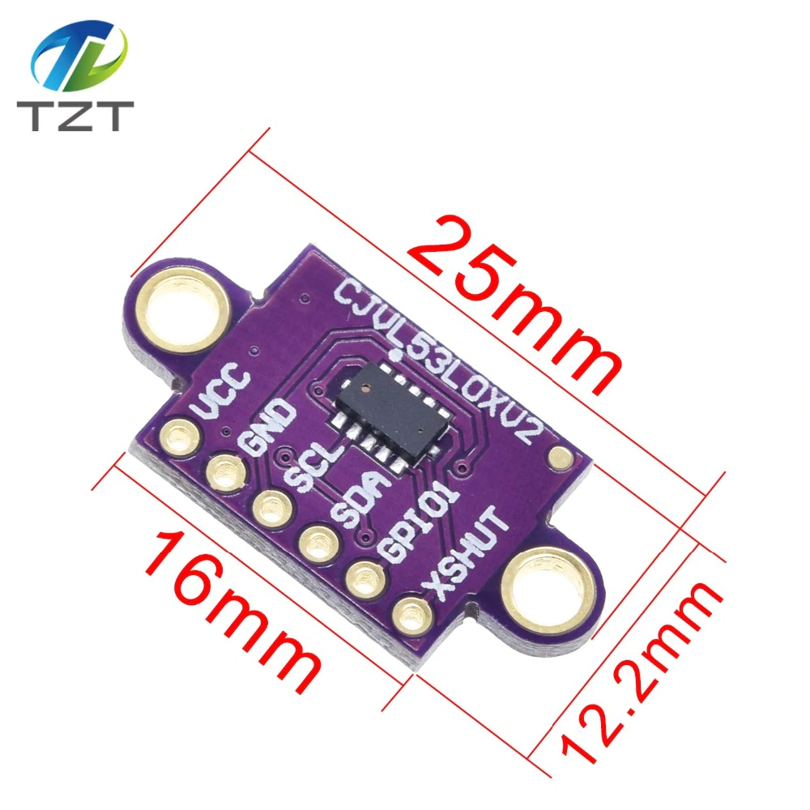

# CJVL53L0XV2

Тест лазерного дальномера
- - -

## Схема подключения

| CJVL53L0XV2 | Arduino Nano |
|--------|--------|
|VCC | 5V|
|GND | GND|
|SCL | A5|
|SDA | A4|

5V лучше взять не от платы, а от другого стабильного источника.